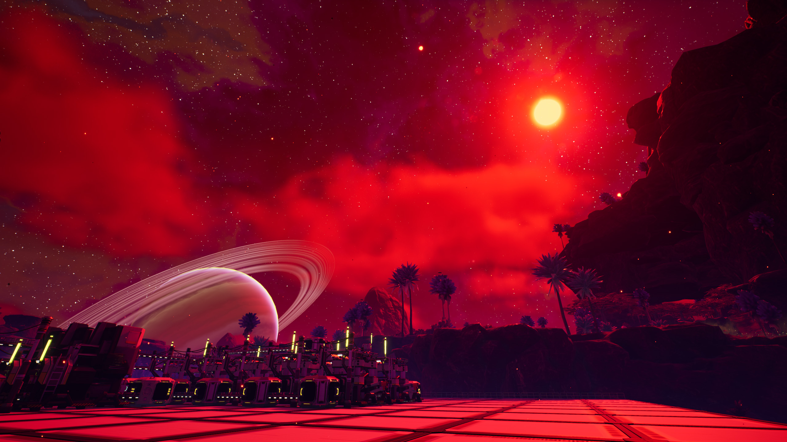
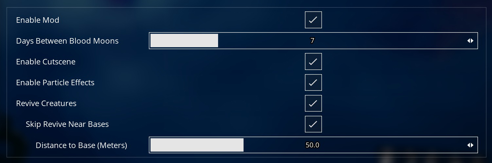

# Blood Moon
### A Satisfactory mod that periodically turns the moon blood red and (optionally) revives creatures in the world.

 
 

  

 

## Features
### 🌕 Experience the Blood Moon
Every 7 nights, the blood moon rises, bathing the world in red. (The number of days between blood moons can be changed in the settings.)

### 🦏 Revive Creatures
At midnight on the night of a blood moon, all the creatures of the world come back to life. (This can be completely disabled or tweaked in the settings.)

### ✨ Particle Effects
Ash and embers mark the night of a blood moon, increasing in intensity as midnight draws closer. (This can be disabled in the settings.)

### 🌐 Multiplayer
Multiplayer sessions are supported.

 

  
   
  

## Installation
### Option 1: Satisfactory Mod Manager (SMM)
1. If you haven't already, download and install [Satisfactory Mod Manager](https://github.com/satisfactorymodding/SatisfactoryModManager/releases/latest).
2. In the mod manager, search for Blood Moon and install it. You can also go to the mod's page on [Satisfactory Mod Repository (SMR)](https://ficsit.app/mod/BloodMoon) and go to Versions → Install.
3. If you're going to be playing in multiplayer sessions, make sure everyone has the mod installed (both host and clients).

### Option 2: Manual Install
1. Download and install [Satisfactory Mod Loader (SML)](https://docs.ficsit.app/satisfactory-modding/latest/ManualInstallDirections.html).
1. Download the [latest release](https://github.com/chriscavalluzzi/BloodMoon/releases/latest) of this mod.
1. Create a folder called `BloodMoon` inside `<game root>\FactoryGame\Mods`.
1. Extract the contents of the mod file into this folder. If you did it correctly, there should be a file called `BloodMoon.uplugin` in the folder `<game root>\FactoryGame\Mods\BloodMoon`.
1. If you're going to be playing in multiplayer sessions, make sure everyone has the mod installed (both host and clients).

## Reporting
Please report any problems by opening an issue!
